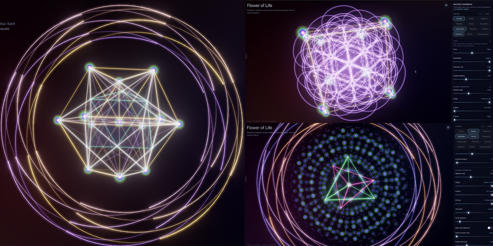

<h1 align="center">Sacred Sandbox</h1>

<p align="center">
  Sacred geometry in three and four dimensions, as a living instrument.<br>
  Runs in a browser. No plugin, no install, no app store.
</p>

<p align="center">
  <a href="https://hollandrisley.github.io/sacred-sandbox/"><b>Open it →</b></a>
</p>

<p align="center">
  
</p>

---

A single clock drives everything. The centre emanates; shells of the Flower of
Life travel outward while some fall back in; a toroid turns around it; a merkaba
counter-rotates at the core; and the whole figure can be wrapped off the plane
onto a sphere, so the mandala becomes an object you turn rather than a picture
you look at.

Underneath the light show is real mathematics, not decoration. The circles are
solved rather than drawn — Metatron's Cube is derived from the thirteen-circle
construction, the Platonic solids are read off Metatron's own vertices, and the
four-dimensional figures are genuinely projected from R⁴ through a rotation in
six planes. Where a piece of it is a designed effect rather than a derivation,
the code says so.

## What is in it

Every layer can be switched off independently, and most compositions are about
what you take away.

| | |
|---|---|
| **Circles · Nodes** | The Flower of Life through its stages: seed, egg, fruit, full lattice, echoed and repeated |
| **Metatron** | Thirteen points joined every way — a hexagon in two dimensions, the vector equilibrium in three, the 24-cell in four |
| **Platonic** | The five solids, read off Metatron's own vertices, breathing on the master clock |
| **Merkaba** | Two tetrahedra, one inverted, turning against each other |
| **Toroid** | Flow up through the centre and back round the outside, in up to four woven strands bound to the merkaba |
| **Hypercube** | A regular 4-polytope turning in planes that have no axis in our space, projected down into it |
| **Singularity** | Every lattice node lifted through the Hopf fibration into a linked circle in 4-space, stacked at nested scales |
| **Fibonacci** | The golden spiral, phyllotaxis, and the golden rectangles |
| **Spirals** | Arms emanating outward from the centre, opposite each other in space |
| **Particles** | Light travelling along every path, as spheres, flowers, hearts or your own images |
| **Pure geometry** | Radial emission along a Fibonacci sphere of arms |
| **Stars** | A field streaming outward from the middle |
| **Extensions** | Up to four pieces of contributed maths, running at once |

Plus rainbows that ride the existing linework, prismatic dispersion, five
palettes, and per-layer colour and opacity.

## Making something

- **Ask for it** — type "open the chakra, let it flow" and it composes the named
  setups that match. Thirty-odd of them, reached by phrase rather than by menu,
  matched locally so the page stays static and works offline.
- **A gallery** — save a composition with a rendered preview and come back to it.
  Everything stays in your browser.
- **Share by link** — a position becomes a URL, camera angle included. The whole
  setup travels in the fragment; nothing is uploaded and no account exists.
- **Sideways on a phone** — three columns: the artwork, a rail of sections, and
  that section's controls.

Drag to orbit, pinch to zoom, and press the ring in the top right for the
controls. A headset with WebXR gets an immersive session.

## Writing your own geometry

An extension is one function that turns numbers into geometry. The host owns
every three.js object, so you write maths and nothing else:

```js
{
  meta: {
    name: 'Rose',
    params: [{ key: 'petals', label: 'Petals', min: 2, max: 12, step: 1, value: 5 }],
  },
  build(p, t) {
    const points = [];
    for (let i = 0; i <= 240; i++) {
      const a = (i / 240) * Math.PI * 2;
      const r = Math.cos(p.petals * a) * 2;
      points.push(r * Math.cos(a), r * Math.sin(a), Math.sin(a * 3 + t) * 0.4);
    }
    return { paths: [{ points, closed: true }], dots: [] };
  },
}
```

`meta.params` becomes sliders automatically. Paste it into the Studio panel and
it draws in the same glowing linework as everything else.

**It runs in a sandbox, always** — an opaque-origin iframe under a policy with no
network at all, inside a worker that can be terminated, with hard caps on points,
paths and build time. Contributed maths can reach neither the page nor the
internet, which is what makes running somebody else's code safe rather than
brave. See [`docs/extensions.md`](docs/extensions.md) for the full contract.

If you would rather describe it than write it, the Studio can have the code
written for you by a model **running on your own machine** — Ollama, LM Studio,
llama.cpp or vLLM, whichever you already have. It exists only under the dev
server, so no key ever reaches a browser and the published site has no endpoint
to call. Generated code is shown to you, tested in the sandbox, and repaired
automatically if it fails before you ever see it.

## Running it locally

```bash
git clone https://github.com/HollandRisley/sacred-sandbox.git
cd sacred-sandbox
npm install
npm run dev
```

Vite prints two URLs. `Local:` is `http://localhost:5180`; `Network:` is the one
to open on a phone on the same Wi-Fi, which is the real test. `npm run build`
produces a static bundle that will sit on any host.

## How it is built

Vanilla JavaScript, Vite, no framework, one dependency: **three.js r185** with
`WebGPURenderer`, which tries WebGPU and falls back to WebGL 2 on its own. The
panel tells you which one you got.

Lines are not line primitives — GPU lines are locked to one pixel at any
distance. Each is a bright core tube, the same tube several times wider and very
faint, and spheres travelling along it. Additive blending accumulates the wide
layer into glow with real volume that occludes correctly from any angle, which a
screen-space blur cannot do. Bloom sits on top for the bleed, not instead of it.

Nothing allocates per frame. Every layer owns a pool sized to its worst case, and
when a figure will not fit inside the instance ceiling it sheds whole copies and
says so in the readout, rather than drawing something half finished.

```
src/main.js        the scene, the clock, the per-frame update
src/state.js       every parameter as one flat object, plus presets
src/ui.js          the panel, built from a declarative spec
src/geometry/*     pure functions over numbers — no renderer, no side effects
src/lib/*          rendering helpers, plus storage, sharing and extensions
worker/            a Cloudflare Worker for the hosted helper (optional)
```

The geometry modules are the part worth taking on their own. `hopf.js`,
`metatron.js`, `solidsFromMetatron.js`, `metatronSpiral.js` and `polytope4d.js`
have no three.js dependency at all, and every claim in their comments was checked
numerically before it was written down.

## Documentation

| | |
|---|---|
| [`docs/design-notes.md`](docs/design-notes.md) | The long version: why each piece of the maths and each visual decision is what it is, including the ones that were wrong first |
| [`docs/extensions.md`](docs/extensions.md) | The extension contract, worked examples, and the limits |
| [`CLAUDE.md`](CLAUDE.md) | The short guide to how not to break it — module map, frame order, invariants |

## Licence

MIT — see [`LICENSE`](LICENSE). Use the maths for anything you like.
